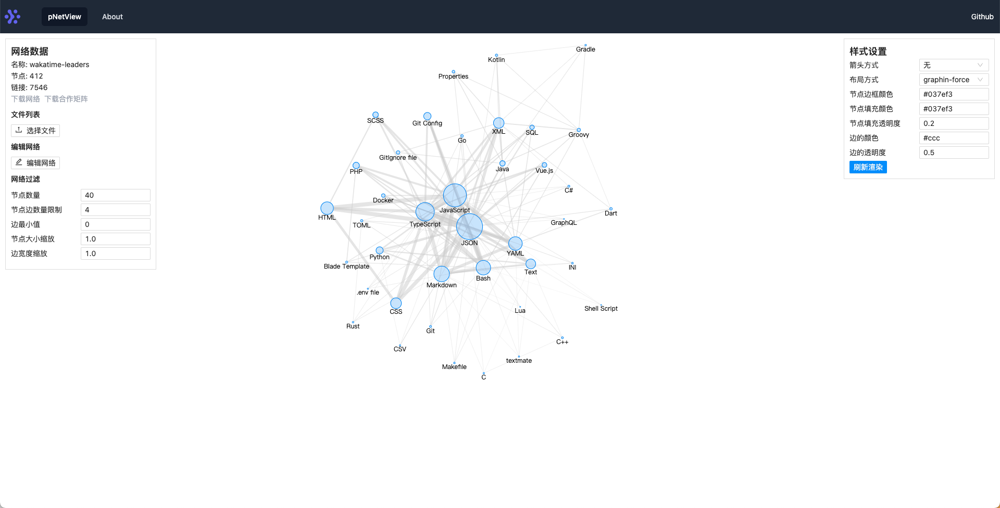

# pNetView

pNetView 是一个网络数据查看工具，可以导入导出和编辑网络数据。

## 示例

[https://phyng.com/pnetview/](https://phyng.com/pnetview/)

默认数据是 WakaTime 的热门语言关系网络图，根据 https://wakatime.com/leaders 前 50 页作者数据生成，数据更新于 2023-01-06。

## 更新日志

- 2021-11-07 初始化
- 2021-12-23 支持数据编辑
- 2023-01-06 更新项目依赖和组件
